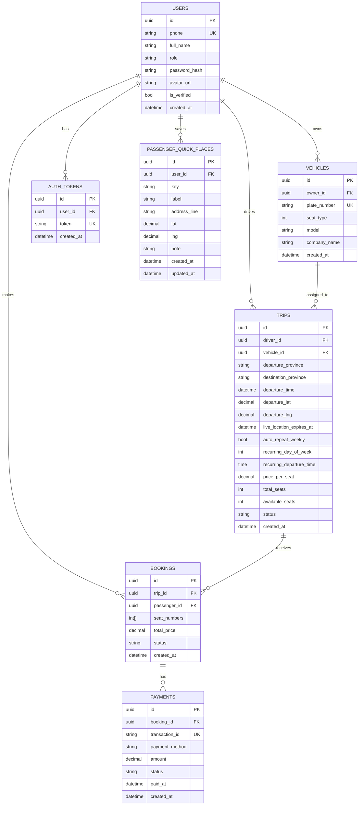

# Project Guide

This file explains what this project does, how it is structured, and how to modify it later with confidence.

## 1. Project Purpose

This is a FastAPI backend project for a travel/rideshare-style system with:
- authentication (signup/login with bearer token)
- users with roles (`passenger`, `driver`)
- vehicles owned by drivers
- trips created by drivers
- bookings created by passengers
- payments tied to bookings
- passenger quick places (`home`, `work`)
- passenger search config for trip schedule + ride choices UI
- live driver departure location (`lat/lng`) on trips
- automatic live-location cleanup after 24 hours
- optional weekly auto-repeat trip settings for drivers

Primary router groups:
- `/travel/*` for auth + core travel flow
- `/passenger/*` for passenger profile quick-place and search-config endpoints

## 2. High-Level Architecture

Main layers used in this project:
- `app/main.py`: FastAPI app entrypoint and router registration
- `app/routes/*.py`: HTTP endpoints and request/response handling
- `app/models.py`: SQLAlchemy ORM models (database tables)
- `app/schemas.py`: Pydantic schemas (validation + API payload shape)
- `app/auth.py`: password hashing, token issuing, and current-user auth dependency
- `app/db.py`: SQLAlchemy engine/session/base setup
- `alembic/`: migrations and schema versioning
- `tests/`: test code

Request flow:
1. Client calls endpoint in `routes`.
2. Route validates body/query with schema from `schemas.py`.
3. Route reads/writes ORM models via SQLAlchemy session.
4. Route returns schema-shaped response.

## 3. Database UML (Entity Relationship)

Use this Mermaid ER diagram in Markdown viewers that support Mermaid:



Important constraints:
- `users.role` in (`passenger`, `driver`)
- `vehicles.seat_type` in (`4`, `15`, `30`, `45`)
- status constraints on trips/bookings/payments
- unique `(user_id, key)` on `passenger_quick_places`
- `trips.recurring_day_of_week` in `0..6` when present

## 4. API Structure (Current)

### Auth and users
- `POST /travel/auth/signup`
- `POST /travel/auth/login`
- `GET /travel/auth/me`
- `GET /travel/users/{user_id}`

### Driver/travel resources
- `POST /travel/vehicles`
- `GET /travel/vehicles/{vehicle_id}`
- `POST /travel/trips`
- `GET /travel/trips/search`
- `GET /travel/trips/{trip_id}`

`/travel/trips` create payload now supports:
- `departure_lat`, `departure_lng`
- `auto_repeat_weekly`
- `recurring_day_of_week`
- `recurring_departure_time`

Live-location behavior:
- if `departure_lat/lng` is set on trip creation, backend sets `live_location_expires_at = now + 24h`
- expired live location is auto-cleared when trip search/detail endpoints are called

### Passenger booking/payment
- `POST /travel/bookings`
- `GET /travel/bookings/{booking_id}`
- `POST /travel/payments`
- `GET /travel/payments/{payment_id}`

### Passenger profile/search config
- `GET /passenger/profile/places`
- `PUT /passenger/profile/places/{key}`
- `GET /passenger/trips/search-config`
- `GET /passenger/nearby-drivers`

`/passenger/trips/search-config` now includes:
- `default_schedule`
- `schedule_options`
- `ride_choices` (`economy`, `comfort`, `premium`, `xl`, `more`)

`/passenger/nearby-drivers` query:
- required: `lat`, `lng`, `radius_km`
- optional: `seat_type` (`4`, `15`, `30`, `45`)

`/passenger/nearby-drivers` response item includes:
- `driver_id`, `trip_id`
- `lat`, `lng`, `speed_kph`, `updated_at`
- `auto_repeat_weekly`
- `seat_type`, `total_seats`, `available_seats`

Filtering behavior:
- always returns only `active` trips with non-expired live location
- if `seat_type` is provided:
- includes only matching seat type
- excludes full vehicles (`available_seats <= 0`)
- requires fresh updates (`updated_at` within 60 seconds)
- if `seat_type` is not provided:
- keeps backward compatibility and returns all nearby live active drivers

## 5. Folder Structure

```text
.
├── app/
│   ├── main.py
│   ├── auth.py
│   ├── config.py
│   ├── db.py
│   ├── models.py
│   ├── schemas.py
│   ├── services.py
│   └── routes/
│       ├── travel.py
│       ├── passenger.py
│       ├── items.py
│       └── meta.py
├── alembic/
│   └── versions/
├── tests/
├── scripts/
├── README.md
└── requirements.txt
```

## 6. How to Modify Later (Safe Checklist)

When adding new feature endpoints:
1. Add/adjust DB model in `app/models.py` if schema changes.
2. Create Alembic migration in `alembic/versions/`.
3. Add request/response schemas in `app/schemas.py`.
4. Add route handlers in `app/routes/*.py`.
5. Register router in `app/main.py` if it is a new router file.
6. Update `README.md` route list.
7. Add or update tests.

When adding a new table:
1. Create model.
2. Run migration generation.
3. Review migration manually (indexes, constraints, FK rules).
4. Apply with `alembic upgrade head`.

When changing auth/permissions:
1. Keep role checks explicit in routes.
2. Re-test passenger vs driver access.
3. Verify token-based identity path via `get_current_user`.

## 7. Recommended Commands

Run app:
```bash
uvicorn app.main:app --reload
```

Run migration:
```bash
alembic upgrade head
```

Create migration:
```bash
alembic revision --autogenerate -m "describe change"
```

Run tests:
```bash
pytest
```

Seed demo data:
```bash
python3 scripts/seed_demo_data.py
```

Run containers:
```bash
docker compose up --build -d
```

## 8. Notes for Future Improvements

- Consider moving business logic from routes into service classes for easier testability.
- Consider token expiration/refresh strategy for auth tokens.
- Add richer passenger quick-place keys if frontend expands beyond `home` and `work`.
- Add endpoint versioning (`/v1/...`) if API scope grows.
- Consider a background scheduler (cron/Celery/APScheduler) for strict time-based live-location cleanup, not only request-time cleanup.
